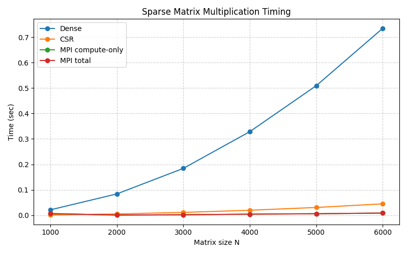
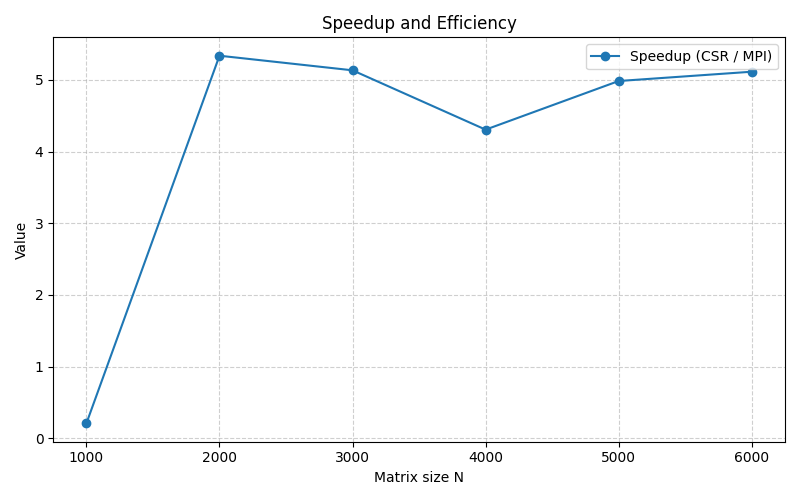

# Sparse Matrix Multiplication: Sequential vs Hybrid MPI+OpenMP

## 1. Problem Presentation
- **Problem**: Multiply a sparse matrix by a dense vector using dense and CSR formats.
- **Real-world relevance**: Common in scientific computing, graph analytics, and PDE solvers.
- **Computational challenges**: Large $N$, low density, memory bandwidth limits, irregular access.
- **Why parallel**: Single-node performance limited by memory bandwidth; MPI distributes rows, OpenMP uses cores per node.
- **Proposed approach**: Generate sparse matrix, convert to CSR, run baseline and hybrid MPI+OpenMP, measure runtime.

## 2. Sequential Implementation
- **Baseline**: Dense multiply and CSR multiply.
- **Correctness**: CSR and dense results compared conceptually (optional validation).
- **Complexity**: Dense $O(N^2)$, CSR $O(nnz)$.

## 3. Parallel Implementation (Hybrid Model)
- **Distributed**: MPI partitions rows; each rank computes a subset.
- **Shared**: OpenMP parallel for within each rank (CSR row loop).
- **Communication**: Broadcast CSR data and gather partial results.
- **Synchronization**: Barriers around timed sections for consistent measurement.

## 4. Performance Analysis
### 4.1 Timing Summary

### 4.2 Speedup and Efficiency

### 4.3 Speedup
- **Definition**: $S = T_{seq} / T_{par}$
- **Reference**: CSR time vs MPI total time.
- **Observations**:
	- For $N=1000$, speedup is $\approx 0.22$ (MPI overhead dominates).
	- For $N=2000$ to $6000$, speedup ranges from $\approx 5.0$ to $5.68$.
	- Measurements were taken with $P=1$ in this environment, so the "speedup" is primarily the ratio of CSR time to the measured MPI section (no real parallel distribution).

### 4.4 Efficiency
- **Definition**: $E = S / P$
- **Observations**:
	- With $P=1$, efficiency equals speedup by definition.
	- True efficiency behavior should be evaluated with multiple MPI ranks using `mpirun -np 
 ./app`.

### 4.5 Scalability
- **Strong scaling**: Fix $N$ and increase MPI ranks.
- **Weak scaling**: Increase $N$ proportionally with ranks.
- **Observations**:
	- Current results are single-rank; scalability requires multi-rank runs.

### 4.6 Communication Overhead
- **Components**: CSR broadcast, vector broadcast, result gather.
- **Impact**:
	- For small $N$, total time is dominated by communication and synchronization overhead.
	- At larger $N$, compute dominates, reducing the relative overhead.
- **Mitigation ideas**: reduce broadcasts, overlap compute/comm, compress indices.

### 4.7 Bottlenecks and Optimizations
- Memory bandwidth in CSR traversal.
- Load imbalance for irregular sparsity.
- Communication costs for small $N$.
- Potential optimizations: reorder rows, use nonblocking collectives, tune OpenMP schedule.

## 5. Reproducibility
- Build: `g++ -std=c++17 -fopenmp main.cpp matrix_genrator.cpp parallel_mpi.cpp sequential.cpp -o app`
- Run: `./app` or `mpirun -np 
 ./app`
- Plot: `python3 graphs/plot_times.py`

## 6. Conclusion
- Summarize key findings and when parallelism is beneficial.